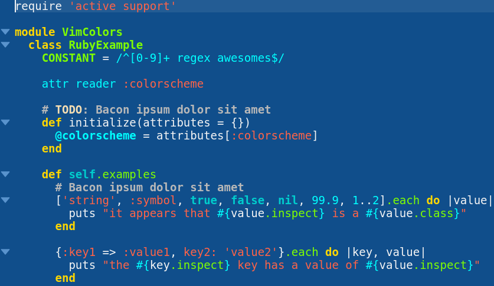

# Blue Mood theme for Kate/Kwrite

This is a port of [emacs's Blue Mood theme](https://emacsthemes.com/themes/blue-mood-theme.html) for Kate and Kwrite.

Keep in mind that this port doesn't correspond 100% to the original emacs theme, due to the differences between Kpart's theming system and emacs's theming system.

## Installation

Download using the GitHub .zip download option and unzip.

## Activation

In Kate's/Kwrite's settings, go to `Fonts and Colors` and click `Import`. From the import dialog, import the `Blue Mood.kateschema` file.

### Usage Note

Note that the above instruction works under a Qt Desktop Environment, like KDE. If you use Kate/Kwrite in a Gtk Desktop Environment instead, the import dialog doesn't detect any *.kateschema files, which effectively means you cannot import any such theme there.
